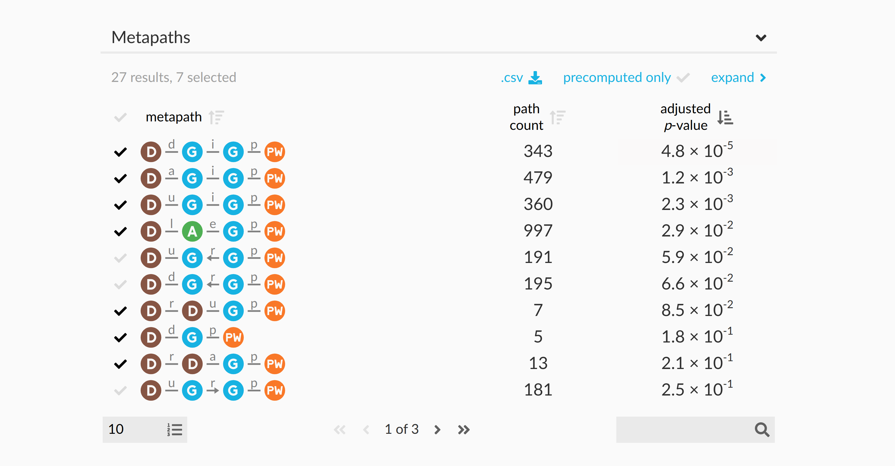
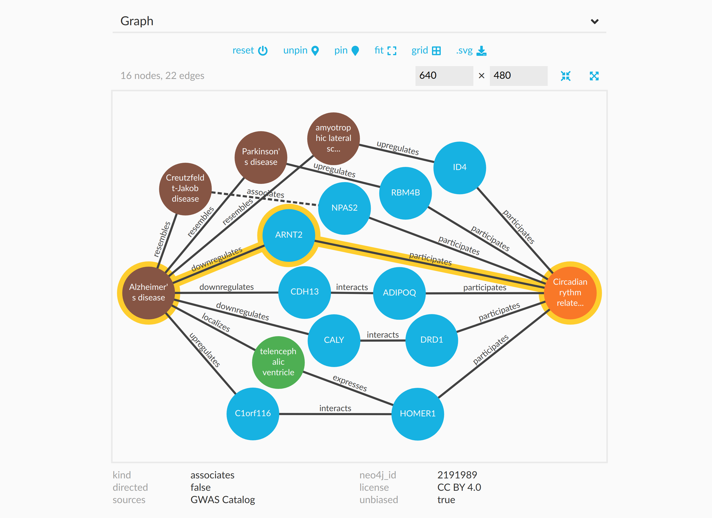

# Manuscript media

For media that shouldn't be exported alongside every manuscript.
Therefore, the contents are placed here instead of in `content/images`.

## Webapp figure components

Based on example from https://slides.com/dhimmel/rocky2019#/4.

`webapp-nodes.png` screenshot from https://het.io/search/?source=17287

`webapp-metapaths.png` screenshot from https://het.io/search/?source=17287&target=7607&metapaths=DaGiGpPW%2CDdGiGpPW%2CDdGpPW%2CDlAeGpPW%2CDrDaGpPW%2CDrDuGpPW%2CDuGiGpPW&complete=

`webapp-metapaths-expanded.png`

`webapp-paths.png`

`webapp-graph.png`

